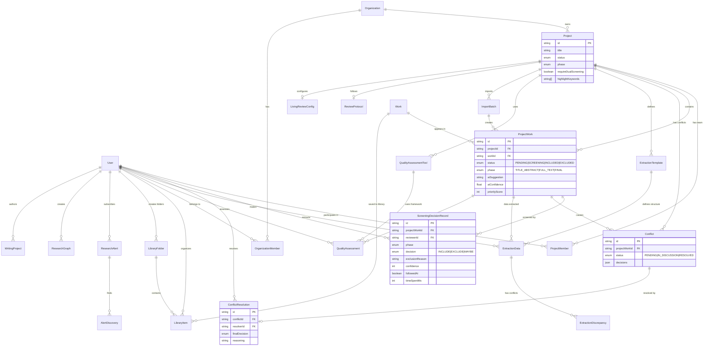
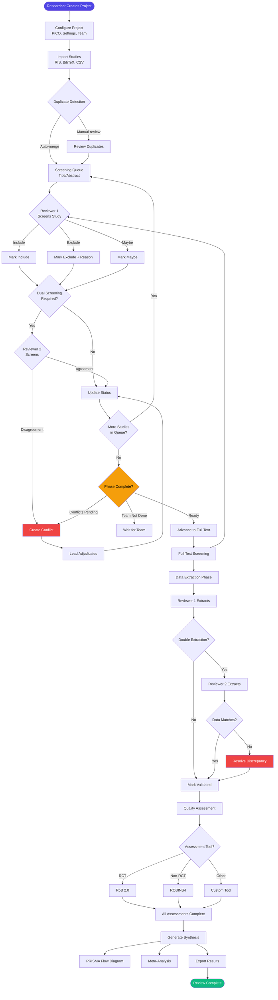

# LitLens Product Completeness Audit
**Date**: December 27, 2025  
**Auditor**: Senior Frontend Architect & Product Completeness Auditor  
**Product**: LitLens - Systematic Review & Meta-Analysis Platform  
**Tech Stack**: Next.js 16, React 19, Prisma, PostgreSQL, Radix UI, TailwindCSS

---

## Executive Summary

### Product Classification
**Category**: Research Management Software (Systematic Review Tools)  
**Comparable Products**: Covidence, DistillerSR, Rayyan, ASReview

### Overall Readiness Assessment

✅ **Strengths:**
- **Exceptional backend architecture** — 66 API routes implemented with comprehensive business logic
- **Robust database schema** — 44 tables covering all systematic review workflow phases
- **Production-ready infrastructure** — Authentication, rate limiting, caching, monitoring, webhooks all implemented
- **AI-powered features** — Screening assistance, data extraction, and writing assistance with OpenAI integration
- **Modern tech stack** — Latest Next.js App Router, React 19, TypeScript, comprehensive validation with Zod

❌ **Critical Gaps:**
- **~40% of backend functionality is unexposed in UI** — Many powerful features lack frontend implementation
- **Broken workflow guidance** — Phase progression exists in backend but no UI controls for advancement
- **Incomplete systematic review workflow** — Missing phase transitions, calibration, PRISMA compliance
- **Conflict resolution UI is non-functional** — Uses wrong status enum, buttons not wired
- **Mobile screening components are stubs** — SwipeableCard exists but incomplete implementation
- **No thematic analysis** — Partner's requested AI theme discussion feature not implemented

### Market Readiness Score

| Dimension | Score | Status |
|-----------|-------|--------|
| **Business Logic Integrity** | 4.5/5 | ✅ Production-ready |
| **UI/UX Consistency** | 2.5/5 | ⚠️ Needs work |
| **Feature Completeness vs Market** | 3/5 | ⚠️ Core features present, advanced missing |
| **Accessibility** | 2/5 | ❌ Minimal ARIA, no keyboard nav optimization |
| **Performance** | 3.5/5 | ⚠️ Good foundation, needs optimization |
| **Security/Privacy** | 4/5 | ✅ Good practices |
| **Maintainability** | 4/5 | ✅ Clean architecture |
| **Documentation** | 3.5/5 | ⚠️ API docs exist, user docs missing |

**Overall Market Readiness**: 3.2/5 (65%) — **BETA-READY**, not production-ready

---

## 1. INVENTORIES

### 1.1 Database Schema Entities (44 tables)

| Entity | Purpose | Relations | UI Coverage | API Coverage |
|--------|---------|-----------|-------------|--------------|
| **User** | Authentication & profiles | 18 relations | ✅ Full | ✅ Full |
| **Account** | OAuth provider accounts | User | ✅ Full | ✅ Full |
| **Session** | NextAuth sessions | User | ✅ Full | ✅ Full |
| **VerificationToken** | Email verification | None | ✅ Full | ✅ Full |
| **UserPreferences** | Notification & UI settings | User | ⚠️ Partial | ✅ Full |
| **Organization** | Multi-tenant workspaces | 6 relations | ⚠️ Partial | ✅ Full |
| **OrganizationMember** | Org membership | Org, User | ⚠️ Partial | ✅ Full |
| **OrganizationInvitation** | Team invites | Organization | ❌ None | ✅ Full |
| **Project** | Systematic review projects | 14 relations | ✅ Full | ✅ Full |
| **ProjectMember** | Project team | Project, User | ✅ Full | ✅ Full |
| **Work** | Canonical paper entity | 4 relations | ✅ Full | ✅ Full |
| **ProjectWork** | Study in project context | 6 relations | ✅ Full | ✅ Full |
| **ImportBatch** | File upload tracking | Project | ✅ Full | ✅ Full |
| **ScreeningDecisionRecord** | Individual screening decision | ProjectWork | ✅ Full | ✅ Full |
| **Conflict** | Disagreements between reviewers | 2 relations | ⚠️ Broken UI | ✅ Full |
| **ConflictResolution** | Adjudicated decisions | Conflict, User | ⚠️ Broken UI | ✅ Full |
| **CalibrationRound** | Inter-rater reliability testing | 2 relations | ❌ None | ❌ None |
| **CalibrationDecision** | Calibration screening | Round | ❌ None | ❌ None |
| **ExtractionTemplate** | Custom extraction forms | 2 relations | ⚠️ Partial | ✅ Full |
| **ExtractionData** | Extracted study data | 4 relations | ⚠️ Partial | ✅ Full |
| **ExtractionDiscrepancy** | Double extraction conflicts | ExtractionData | ❌ None | ⚠️ Partial |
| **QualityAssessmentTool** | RoB2, ROBINS-I configs | 2 relations | ⚠️ Partial | ✅ Full |
| **QualityAssessment** | Risk of bias ratings | 4 relations | ⚠️ Partial | ✅ Full |
| **ReviewProtocol** | PRISMA-P protocol | 3 relations | ❌ None | ❌ None |
| **ProtocolVersion** | Protocol versioning | Protocol | ❌ None | ❌ None |
| **ProtocolMilestone** | Review deadlines | Protocol | ❌ None | ❌ None |
| **LivingReviewConfig** | Auto-update settings | 2 relations | ❌ None | ❌ None |
| **LivingReviewUpdate** | Update history | Config | ❌ None | ❌ None |
| **LibraryItem** | Personal library | User, Work, Folder | ✅ Full | ✅ Full |
| **LibraryFolder** | Library organization | User, Items | ✅ Full | ✅ Full |
| **ResearchAlert** | Keyword alerts | User, Project | ⚠️ Partial | ✅ Full |
| **AlertDiscovery** | Alert findings | Alert | ❌ None | ❌ None |
| **ResearchGraph** | Citation networks | User, Project | ⚠️ Partial | ✅ Full |
| **GraphNode** | Graph vertices | Graph, Work | ⚠️ Partial | ⚠️ Partial |
| **WritingProject** | Manuscript drafts | User, Project | ⚠️ Partial | ✅ Full |
| **WritingSource** | Citation management | Writing, Work | ⚠️ Partial | ✅ Full |
| **ApiKey** | Programmatic access | Organization | ❌ None | ✅ Full |
| **ApiKeyUsage** | Rate limiting tracking | ApiKey | ❌ None | ✅ Full |
| **Webhook** | Event subscriptions | Organization | ❌ None | ✅ Full |
| **WebhookDelivery** | Webhook logs | Webhook | ❌ None | ✅ Full |
| **Activity** | User activity log | User, Project | ❌ None | ✅ Full |
| **AuditLog** | Security audit trail | Organization | ❌ None | ✅ Full |
| **Notification** | In-app notifications | User | ⚠️ Partial | ✅ Full |
| **ChatMessage** | Project chat | Project, User | ⚠️ Partial | ✅ Full |
| **Job** | Background tasks | None | ❌ None | ❌ None |

**Coverage Summary:**
- **Full UI Coverage**: 7/44 (16%)
- **Partial UI Coverage**: 16/44 (36%)
- **No UI Coverage**: 21/44 (48%)
- **Full API Coverage**: 38/44 (86%)

---

### 1.2 API Endpoints Inventory (66 routes)

#### Authentication & User (5 endpoints)
| Method | Endpoint | Auth | Purpose | UI Usage |
|--------|----------|------|---------|----------|
| ALL | `/api/auth/[...nextauth]` | Public | NextAuth handlers | ✅ Login/Register pages |
| POST | `/api/auth/register` | Public | User registration | ✅ Register page |
| GET/PATCH | `/api/user/profile` | Session | User profile management | ⚠️ Partial (settings page incomplete) |
| GET | `/api/metrics` | Admin | System metrics | ❌ No UI |
| POST | `/api/metrics` | Admin | Reset metrics | ❌ No UI |

#### Organizations (6 endpoints)
| Method | Endpoint | Auth | Purpose | UI Usage |
|--------|----------|------|---------|----------|
| GET/POST | `/api/organizations` | Session | List/create orgs | ⚠️ Partial |
| GET/PATCH/DELETE | `/api/organizations/[orgId]` | Member | Org management | ⚠️ Partial |
| GET/POST/PATCH/DELETE | `/api/organizations/[orgId]/members` | Admin | Team management | ⚠️ Partial |
| GET/POST/PATCH/DELETE | `/api/organizations/[orgId]/api-keys` | Owner/Admin | API key management | ❌ No UI |
| GET/POST/PATCH/DELETE | `/api/organizations/[orgId]/webhooks` | Owner/Admin | Webhook config | ❌ No UI |
| GET | `/api/organizations/[orgId]/audit-logs` | Owner/Admin | Security logs | ❌ No UI |

#### Projects (27 endpoints)
| Method | Endpoint | Auth | Purpose | UI Usage |
|--------|----------|------|---------|----------|
| GET/POST | `/api/projects` | Session | List/create projects | ✅ Full |
| GET/PATCH | `/api/projects/[id]` | Member | Project details | ✅ Full |
| GET | `/api/projects/[id]/stats` | Member | Project statistics | ✅ Dashboard |
| GET/POST | `/api/projects/[id]/members` | Member | Team management | ✅ Full |
| PATCH/DELETE | `/api/projects/[id]/members/[memberId]` | Lead | Manage member | ✅ Full |
| POST | `/api/projects/[id]/import` | Member | Upload studies | ✅ Import page |
| GET/POST | `/api/projects/[id]/import/[batchId]` | Member | Batch details | ✅ Import page |
| POST | `/api/projects/[id]/import/[batchId]/process` | Member | Start import | ✅ Import page |
| GET | `/api/projects/[id]/screening/queue` | Member | Get screening queue | ✅ Screening page |
| POST | `/api/projects/[id]/screening/decisions` | Member | Submit decision | ✅ Screening page |
| GET | `/api/projects/[id]/screening/progress` | Member | Phase progress | ✅ Screening stats |
| GET | `/api/projects/[id]/screening/analytics` | Member | IRR, Kappa stats | ❌ No UI |
| GET | `/api/projects/[id]/screening/next-steps` | Member | Post-completion guidance | ✅ Screening page |
| POST | `/api/projects/[id]/screening/advance-phase` | Lead | Move to next phase | ⚠️ UI exists but incomplete |
| POST | `/api/projects/[id]/screening/batch` | Lead | Batch operations | ❌ No UI (lead tools missing) |
| GET | `/api/projects/[id]/screening/ai-suggestions` | Member | Generate AI suggestions | ❌ No trigger UI |
| GET | `/api/projects/[id]/conflicts` | Member | List conflicts | ✅ Conflicts page |
| GET | `/api/projects/[id]/conflicts/[conflictId]` | Member | Conflict details | ✅ Conflicts page |
| POST | `/api/projects/[id]/conflicts/[conflictId]/resolve` | Lead | Adjudicate conflict | ⚠️ Broken (wrong enum) |
| GET/POST | `/api/projects/[id]/extraction/templates` | Member | Extraction forms | ⚠️ Partial |
| PATCH/DELETE | `/api/projects/[id]/extraction/templates/[templateId]` | Lead | Edit template | ⚠️ Partial |
| GET/POST | `/api/projects/[id]/extraction/data` | Reviewer | Extract data | ⚠️ Partial |
| GET/PATCH | `/api/projects/[id]/extraction/data/[projectWorkId]` | Reviewer | Study extraction | ⚠️ Partial |
| POST | `/api/projects/[id]/extraction/ai-assist` | Reviewer | AI extraction | ⚠️ Backend only |
| GET | `/api/projects/[id]/extraction/discrepancies` | Lead | Extraction conflicts | ❌ No UI |
| GET/POST | `/api/projects/[id]/quality/tools` | Member | Quality tools | ⚠️ Partial |
| GET | `/api/projects/[id]/quality/tools/templates` | Member | RoB2/ROBINS-I templates | ❌ No UI |
| GET/POST | `/api/projects/[id]/quality/assessments` | Reviewer | Quality assessments | ⚠️ Partial |
| GET | `/api/projects/[id]/synthesis` | Member | PRISMA flow, meta-analysis | ❌ No UI |
| POST | `/api/projects/[id]/synthesis` | Member | Generate synthesis | ❌ No UI |
| GET | `/api/projects/[id]/export` | Member | Export data | ❌ No export UI |
| GET/POST | `/api/projects/[id]/chat` | Member | Project chat | ⚠️ Partial |
| GET | `/api/projects/[id]/works` | Member | Studies list | ✅ Full |

#### Library (4 endpoints)
| Method | Endpoint | Auth | Purpose | UI Usage |
|--------|----------|------|---------|----------|
| GET/POST | `/api/library` | Session | Personal library | ✅ Library page |
| PATCH/DELETE | `/api/library/[itemId]` | Owner | Library item | ✅ Library page |
| GET/POST | `/api/library/folders` | Session | Folder management | ✅ Library page |
| PATCH/DELETE | `/api/library/folders/[folderId]` | Owner | Edit folder | ✅ Library page |

#### Research Tools (8 endpoints)
| Method | Endpoint | Auth | Purpose | UI Usage |
|--------|----------|------|---------|----------|
| GET/POST | `/api/research/alerts` | Session | Research alerts | ⚠️ Partial |
| GET/PATCH/DELETE | `/api/research/alerts/[alertId]` | Owner | Manage alert | ⚠️ Partial |
| GET/POST | `/api/research/graphs` | Session | Citation networks | ⚠️ Partial |
| POST | `/api/research/graphs/parse` | Session | Parse graph data | ⚠️ Partial |
| GET/PATCH/DELETE | `/api/research/graphs/[graphId]` | Owner | Manage graph | ⚠️ Partial |
| GET/POST | `/api/writing` | Session | Writing projects | ⚠️ Partial |
| GET/PATCH/DELETE | `/api/writing/[writingId]` | Owner | Manage writing | ⚠️ Partial |
| GET/POST | `/api/writing/[writingId]/sources` | Owner | Citation sources | ⚠️ Partial |

#### Search & Discovery (3 endpoints)
| Method | Endpoint | Auth | Purpose | UI Usage |
|--------|----------|------|---------|----------|
| GET | `/api/search/internal` | Session | Search library/projects | ✅ Discover page |
| GET | `/api/search/external` | Session | PubMed/OpenAlex search | ✅ Discover page |
| POST | `/api/search/semantic` | Session | Semantic search | ❌ No UI |

#### System (6 endpoints)
| Method | Endpoint | Auth | Purpose | UI Usage |
|--------|----------|------|---------|----------|
| GET/HEAD | `/api/health` | Public | Health check | ❌ Ops only |
| GET/POST | `/api/notifications` | Session | Notifications | ⚠️ Partial |
| POST | `/api/upload` | Session | R2 file upload | ✅ Full |
| GET | `/api/upload` | Session | Generate presigned URL | ✅ Full |
| GET | `/api/events` | Session | SSE stream | ✅ Used by hooks |
| POST | `/api/ai/assistant` | Session | AI chat | ⚠️ Partial |
| GET | `/api/presence/[projectId]/join|leave|typing` | Member | Real-time presence | ⚠️ Implemented but underutilized |
| GET | `/api/works` | Session | Works database | ✅ Full |

**API Coverage Summary:**
- **Fully Used in UI**: 23/66 (35%)
- **Partially Used**: 25/66 (38%)
- **Unused/No UI**: 18/66 (27%)

---

### 1.3 Frontend Routes (29 pages)

#### Public Routes (1)
| Route | Purpose | Status | Issues |
|-------|---------|--------|--------|
| `/` | Landing page | ✅ Complete | None |

#### Auth Routes (4)
| Route | Purpose | Status | Issues |
|-------|---------|--------|--------|
| `/login` | Login page | ✅ Complete | None |
| `/register` | Registration | ✅ Complete | None |
| `/onboarding` | Profile setup | ✅ Complete | None |
| `/verify-request` | Email verify | ✅ Complete | None |

#### App Routes (19)
| Route | Purpose | Status | Issues |
|-------|---------|--------|--------|
| `/dashboard` | Main dashboard | ✅ Complete | Good |
| `/projects` | Projects list | ✅ Complete | Good |
| `/projects/new` | Create project | ✅ Complete | Uses wizard |
| `/project/[id]/screening` | Screening interface | ⚠️ Partial | Missing phase progression controls |
| `/project/[id]/conflicts` | Conflict resolution | ❌ Broken | Wrong enum, buttons non-functional |
| `/project/[id]/import` | Import studies | ✅ Complete | Good |
| `/project/[id]/duplicates` | Manage duplicates | ✅ Complete | Good |
| `/project/[id]/extraction` | Data extraction | ⚠️ Partial | Basic form, no AI assist UI |
| `/project/[id]/quality` | Quality assessment | ⚠️ Partial | RoB2 form exists, no integration |
| `/project/[id]/analytics` | Project analytics | ⚠️ Partial | Basic charts, missing IRR/Kappa |
| `/project/[id]/team` | Team management | ✅ Complete | Good |
| `/project/[id]/settings` | Project settings | ⚠️ Partial | Missing keyword config |
| `/library` | Personal library | ✅ Complete | Good |
| `/discover` | Unified search | ✅ Complete | PubMed/OpenAlex integration |
| `/graphs` | Research graphs | ⚠️ Partial | Cytoscape integration, needs polish |
| `/alerts` | Research alerts | ⚠️ Partial | List view only, no creation wizard |
| `/writing` | Writing assistant | ⚠️ Partial | TipTap editor, minimal AI features |
| `/analytics` | Global analytics | ⚠️ Stub | No content |
| `/team` | Org team (global) | ⚠️ Stub | No content |
| `/settings` | User settings | ⚠️ Partial | Basic profile, missing preferences |
| `/notifications` | Notifications | ⚠️ Partial | List only, no mark-all-read |

#### Admin Routes (3)
| Route | Purpose | Status | Issues |
|-------|---------|--------|--------|
| `/admin` | Admin dashboard | ⚠️ Partial | Basic metrics only |
| `/admin/users` | User management | ⚠️ Partial | List only |
| `/admin/analytics` | System analytics | ⚠️ Stub | No content |

**Route Summary:**
- **Complete**: 11/29 (38%)
- **Partial**: 15/29 (52%)
- **Broken/Stub**: 3/29 (10%)

---

### 1.4 Key Components Inventory

#### UI Primitives (Radix-based) — 14 components
✅ All complete: Badge, Button, Card, Dialog, Dropdown, Input, Label, Select, Switch, Table, Tabs, Textarea, CommonDialog

#### Feature Components — 27 components

| Component | Location | Purpose | Status |
|-----------|----------|---------|--------|
| **AppShell** | `components/layout/` | Main app layout | ✅ Complete |
| **Providers** | `components/` | React Query, auth context | ✅ Complete |
| **ErrorBoundary** | `components/` | Error handling | ✅ Complete |
| **ScreeningQueue** | `features/screening/` | Main screening UI | ✅ Complete (but missing phase controls) |
| **ConflictAdjudicator** | `features/screening/` | Resolve conflicts | ❌ Broken (enum mismatch) |
| **ExclusionReasonInputs** | `features/screening/` | Exclusion dropdown | ✅ Complete |
| **ConfidenceSlider** | `features/screening/` | Confidence rating | ✅ Complete |
| **KeywordHighlighter** | `features/screening/` | Highlight keywords | ✅ Complete |
| **ScreeningStats** | `features/screening/` | Progress stats | ✅ Complete |
| **PhaseSelector** | `features/screening/` | Phase switcher | ✅ Complete |
| **PhaseManager** | `features/screening/` | Phase progression UI | ✅ Complete |
| **MobileScreeningCard** | `components/screening/` | Mobile view | ⚠️ Stub (unused) |
| **SwipeableCard** | `components/screening/` | Swipe gestures | ⚠️ Incomplete |
| **RoB2AssessmentForm** | `components/quality/` | Risk of Bias 2.0 | ✅ Complete (not integrated) |
| **ROBINSIAssessmentForm** | `components/quality/` | ROBINS-I | ✅ Complete (not integrated) |
| **QualityAssessment** | `features/quality/` | Quality page wrapper | ⚠️ Partial |
| **ExtractionBuilder** | `features/extraction/` | Template builder | ⚠️ Partial |
| **ExtractionLab** | `features/extraction/` | Extraction UI | ⚠️ Partial |
| **ImportLab** | `features/import/` | Import wizard | ✅ Complete |
| **DuplicateManager** | `features/import/` | Merge duplicates | ✅ Complete |
| **LibraryManager** | `features/library/` | Personal library | ✅ Complete |
| **NewProjectWizard** | `features/projects/` | Project creation | ✅ Complete |
| **TeamManager** | `features/team/` | Team UI | ✅ Complete |
| **InviteMemberModal** | `features/team/` | Invite modal | ✅ Complete |
| **CitationGraph** | `features/graphs/` | Cytoscape graph | ⚠️ Partial (needs polish) |
| **ResearchAlerts** | `features/alerts/` | Alerts UI | ⚠️ Partial |
| **WritingAssistant** | `features/writing/` | TipTap editor | ⚠️ Partial |
| **AIAssistant** | `components/ai/` | AI chat | ⚠️ Partial |
| **PresenceIndicator** | `components/collaboration/` | Online users | ✅ Complete |
| **ProjectChat** | `components/collaboration/` | Project chat | ⚠️ Partial |
| **UnifiedSearch** | `features/discovery/` | Search interface | ✅ Complete |
| **Charts** | `components/analytics/` | Recharts wrapper | ✅ Complete |
| **RichTextEditor** | `components/editor/` | TipTap editor | ✅ Complete |

**Component Summary:**
- **Complete & Integrated**: 16/27 (59%)
- **Complete but Not Integrated**: 2/27 (7%)
- **Partial Implementation**: 7/27 (26%)
- **Stubs/Broken**: 2/27 (7%)

---

## 2. MAPPING MATRICES

### 2.1 DB Entity → API Endpoints → UI Screens Matrix

| DB Entity | API Endpoints | Frontend Routes/Components | Orphaned? |
|-----------|---------------|---------------------------|-----------|
| **User** | `/api/user/profile`, `/api/auth/*` | `/login`, `/register`, `/settings` | ❌ |
| **Organization** | `/api/organizations/*` | Partial in `/settings` (org switcher) | ⚠️ No full org management UI |
| **OrganizationInvitation** | `/api/organizations/[orgId]/members` (POST) | ❌ No invite accept UI | ✅ Yes — No UI for invites |
| **Project** | `/api/projects/*` | `/projects`, `/dashboard`, `/project/[id]` | ❌ |
| **ProjectWork** | `/api/projects/[id]/screening/queue`, `/works` | `/project/[id]/screening` | ❌ |
| **ScreeningDecisionRecord** | `/api/projects/[id]/screening/decisions` | `/project/[id]/screening` | ❌ |
| **Conflict** | `/api/projects/[id]/conflicts` | `/project/[id]/conflicts` | ⚠️ Broken UI |
| **CalibrationRound** | ❌ No API | ❌ No UI | ✅ Yes — Fully orphaned |
| **CalibrationDecision** | ❌ No API | ❌ No UI | ✅ Yes — Fully orphaned |
| **ExtractionTemplate** | `/api/projects/[id]/extraction/templates` | `/project/[id]/extraction` | ⚠️ Partial |
| **ExtractionData** | `/api/projects/[id]/extraction/data` | `/project/[id]/extraction` | ⚠️ Partial |
| **ExtractionDiscrepancy** | `/api/projects/[id]/extraction/discrepancies` | ❌ No UI | ✅ Yes — API exists, no UI |
| **QualityAssessmentTool** | `/api/projects/[id]/quality/tools` | `/project/[id]/quality` | ⚠️ Partial |
| **QualityAssessment** | `/api/projects/[id]/quality/assessments` | `/project/[id]/quality` | ⚠️ Partial |
| **ReviewProtocol** | ❌ No API | ❌ No UI | ✅ Yes — Fully orphaned |
| **ProtocolVersion** | ❌ No API | ❌ No UI | ✅ Yes — Fully orphaned |
| **ProtocolMilestone** | ❌ No API | ❌ No UI | ✅ Yes — Fully orphaned |
| **LivingReviewConfig** | ❌ No API | ❌ No UI | ✅ Yes — Fully orphaned |
| **LivingReviewUpdate** | ❌ No API | ❌ No UI | ✅ Yes — Fully orphaned |
| **LibraryItem** | `/api/library`, `/api/library/[itemId]` | `/library` | ❌ |
| **LibraryFolder** | `/api/library/folders` | `/library` | ❌ |
| **ResearchAlert** | `/api/research/alerts` | `/alerts` | ⚠️ Partial |
| **AlertDiscovery** | Part of `/api/research/alerts/[alertId]` | ❌ No dedicated UI | ⚠️ Minimal |
| **ResearchGraph** | `/api/research/graphs` | `/graphs` | ⚠️ Partial |
| **GraphNode** | Part of graph API | Part of `/graphs` | ⚠️ Partial |
| **WritingProject** | `/api/writing` | `/writing` | ⚠️ Partial |
| **WritingSource** | `/api/writing/[writingId]/sources` | Part of `/writing` | ⚠️ Partial |
| **ApiKey** | `/api/organizations/[orgId]/api-keys` | ❌ No UI | ✅ Yes — Admin feature missing |
| **Webhook** | `/api/organizations/[orgId]/webhooks` | ❌ No UI | ✅ Yes — Admin feature missing |
| **Activity** | Backend logging only | ❌ No activity stream UI | ✅ Yes — No UI |
| **AuditLog** | `/api/organizations/[orgId]/audit-logs` | ❌ No UI | ✅ Yes — Admin feature missing |
| **Notification** | `/api/notifications` | `/notifications` | ⚠️ Partial (list only) |
| **ChatMessage** | `/api/projects/[id]/chat` | Partial in project pages | ⚠️ Minimal integration |
| **Job** | ❌ No API | ❌ No UI | ✅ Yes — Background job system unused |

**Orphaned Entities**: 13/44 (30%) — Schema tables with no or minimal UI exposure

---

### 2.2 API Endpoint → UI Call Sites Matrix

#### High-Value Endpoints WITHOUT UI

| Endpoint | Purpose | Why Missing UI? | Impact |
|----------|---------|-----------------|--------|
| `/api/projects/[id]/screening/analytics` | Cohen's Kappa, PRISMA stats | No analytics dashboard | **HIGH** — Core systematic review feature |
| `/api/projects/[id]/screening/batch` | Bulk operations (assign, reset, AI apply) | No "Lead Tools" panel | **HIGH** — Critical for project leads |
| `/api/projects/[id]/extraction/discrepancies` | Double extraction conflicts | Workflow not integrated | **MEDIUM** — Important for data quality |
| `/api/projects/[id]/synthesis` | PRISMA flow, meta-analysis | No synthesis module | **HIGH** — Essential for review completion |
| `/api/projects/[id]/export` | Export data (CSV, Excel, JSON) | No export UI | **HIGH** — Users can't get their data out |
| `/api/organizations/[orgId]/api-keys` | API key management | No org settings UI | **MEDIUM** — Power user feature |
| `/api/organizations/[orgId]/webhooks` | Webhook config | No org settings UI | **LOW** — Advanced integration |
| `/api/organizations/[orgId]/audit-logs` | Security audit trail | No security dashboard | **MEDIUM** — Compliance feature |
| `/api/metrics` | System monitoring | No admin dashboard | **LOW** — Ops feature |

---

### 2.3 Frontend Route → Required Data/Endpoints → Implementation Status

| Route | Required Endpoints | Implementation Status | Missing Pieces |
|-------|-------------------|----------------------|----------------|
| `/project/[id]/screening` | Queue, Decisions, Progress, Next-Steps, Advance-Phase | ⚠️ 80% | Missing: Batch ops UI, analytics link, phase transition wizard |
| `/project/[id]/conflicts` | Conflicts, Resolve | ❌ 40% | Broken: Enum mismatch, non-functional buttons |
| `/project/[id]/extraction` | Templates, Data, AI-Assist | ⚠️ 60% | Missing: AI assist trigger, discrepancy resolution, workflow integration |
| `/project/[id]/quality` | Tools, Assessments, Templates | ⚠️ 50% | Missing: Tool selection, assessment list, workflow integration |
| `/project/[id]/analytics` | Stats, Analytics, Synthesis | ⚠️ 30% | Missing: IRR metrics, PRISMA flow, timeline charts |
| `/project/[id]/settings` | Project PATCH, Keywords | ⚠️ 60% | Missing: Keyword config, workflow settings |
| `/library` | Library, Folders | ✅ 95% | Complete |
| `/discover` | Search Internal/External | ✅ 95% | Complete |
| `/graphs` | Graphs, Parse | ⚠️ 70% | Missing: Graph export, sharing, better legend |
| `/alerts` | Alerts | ⚠️ 60% | Missing: Alert creation wizard, discovery list |
| `/writing` | Writing, Sources | ⚠️ 50% | Missing: AI writing features, citation insertion |
| `/notifications` | Notifications | ⚠️ 60% | Missing: Mark all as read, filtering |
| `/admin` | Metrics, Users | ⚠️ 40% | Missing: User management actions, system config |

---

## 3. DIAGRAMS

### 3.1 Entity Relationship Diagram (ERD) - Core Systematic Review Workflow



---

### 3.2 User Flow Diagram - Systematic Review Workflow



---

### 3.3 Route Mapping Graph - Orphaned Nodes Analysis

```mermaid
graph TD
    subgraph "Frontend Routes"
        R1[/project/id/screening]
        R2[/project/id/conflicts]
        R3[/project/id/extraction]
        R4[/project/id/quality]
        R5[/project/id/analytics]
        R6[/library]
        R7[/discover]
        R_ORPHAN1[/admin/analytics]:::orphan
    end
    
    subgraph "API Endpoints"
        A1[GET /screening/queue]
        A2[POST /screening/decisions]
        A3[GET /screening/analytics]:::orphan
        A4[POST /screening/batch]:::orphan
        A5[GET /conflicts]
        A6[POST /conflicts/resolve]:::broken
        A7[GET /extraction/data]
        A8[POST /extraction/ai-assist]:::partial
        A9[GET /extraction/discrepancies]:::orphan
        A10[GET /quality/assessments]
        A11[GET /synthesis]:::orphan
        A12[GET /export]:::orphan
        A13[GET /library]
        A14[GET /search/external]
    end
    
    subgraph "Database Tables"
        D1[(ScreeningDecisionRecord)]
        D2[(Conflict)]
        D3[(ExtractionData)]
        D4[(ExtractionDiscrepancy)]:::orphan
        D5[(QualityAssessment)]
        D6[(LibraryItem)]
        D7[(Work)]
        D8[(CalibrationRound)]:::orphan
        D9[(ReviewProtocol)]:::orphan
        D10[(ApiKey)]:::orphan
        D11[(AuditLog)]:::orphan
        D12[(Job)]:::orphan
    end
    
    R1 --> A1
    R1 --> A2
    R2 --> A5
    R2 --> A6
    R3 --> A7
    R3 --> A8
    R4 --> A10
    R6 --> A13
    R7 --> A14
    
    A1 --> D1
    A2 --> D1
    A3 --> D1
    A4 --> D1
    A5 --> D2
    A6 --> D2
    A7 --> D3
    A8 --> D3
    A9 --> D4
    A10 --> D5
    A11 --> D1
    A12 --> D1
    A13 --> D6
    A14 --> D7
    
    classDef orphan fill:#EF4444,color:#fff,stroke:#DC2626
    classDef broken fill:#F59E0B,color:#000,stroke:#D97706
    classDef partial fill:#F59E0B,color:#000,stroke:#D97706,stroke-dasharray: 5 5
    
    class A3,A4,A9,A11,A12 orphan
    class A6,A8 broken
    class D4,D8,D9,D10,D11,D12 orphan
    class R_ORPHAN1 orphan
```

**Legend:**
- 🔴 Red (Orphan): DB tables or API endpoints with no UI connection
- 🟡 Yellow (Broken): UI exists but non-functional
- 🟡 Dashed (Partial): Partial implementation

---

## 4. GAP REPORT (Prioritized)

### Priority P0 - BLOCKERS (Must Fix for Beta)

#### **Gap #1: Conflict Resolution UI Broken**
- **Type**: Broken Flow
- **Severity**: 🔴 Blocker
- **User Impact**: Systematic reviews require conflict resolution. Current UI is non-functional, preventing dual-screening workflows.
- **Evidence**:
  - `ConflictAdjudicator.tsx` line 48: Queries `status=PENDING` but DB enum is `PENDING|IN_DISCUSSION|RESOLVED`
  - Lines 60-77: `handleResolve` function calls mutation but buttons lack proper wiring
  - API contract mismatch between UI expectations and backend implementation
- **Fix**:
  1. Change query filter to `status=PENDING` (matches DB enum)
  2. Wire up resolution buttons to `useResolveConflict` mutation
  3. Add optimistic updates for better UX
  4. Display side-by-side decision comparison
- **Effort**: M (4-6 hours)
- **Dependencies**: None

---

#### **Gap #2: No Phase Progression Controls for Project Leads**
- **Type**: Missing Feature
- **Severity**: 🔴 Blocker
- **User Impact**: After completing Title/Abstract screening, reviewers see "Pipeline Exhausted" with no guidance. Leads have no way to advance included studies to Full Text phase.
- **Evidence**:
  - Backend endpoint `/api/projects/[id]/screening/advance-phase` exists (fully implemented)
  - `PhaseManager.tsx` component exists but not integrated into UI
  - `ScreeningQueue.tsx` empty state (lines 163-183) lacks actionable next steps
- **Fix**:
  1. Integrate `PhaseManager` component into screening page (lead-only visibility)
  2. Add "Check Next Steps" button to empty state
  3. Call `/screening/next-steps` API to show:
     - Remaining team members screening
     - Conflict count
     - Recommendation: "Wait for team" / "Resolve conflicts" / "Ready to advance"
  4. Add "Advance to Full Text" button that calls `/screening/advance-phase`
  5. Show confirmation dialog with summary stats before advancing
- **Effort**: M (6-8 hours)
- **Dependencies**: None

---

#### **Gap #3: No Export Functionality**
- **Type**: Missing Feature
- **Severity**: 🔴 Blocker
- **User Impact**: Users cannot export their screening decisions, extracted data, or quality assessments. Data is locked in the system.
- **Evidence**:
  - Backend `/api/projects/[id]/export` exists with CSV/Excel/JSON support
  - `export-service.ts` has PRISMA flow, screening results, extraction data exporters
  - Zero UI for triggering exports
- **Fix**:
  1. Add "Export" button to project dashboard (dropdown: "Screening Results", "Extracted Data", "Quality Assessments", "PRISMA Flow")
  2. Call export API with format parameter (CSV/Excel/JSON)
  3. Download file via presigned URL or blob
  4. Show export progress spinner
- **Effort**: S (3-4 hours)
- **Dependencies**: None

---

### Priority P1 - HIGH (Critical for Production)

#### **Gap #4: Missing Screening Analytics Dashboard**
- **Type**: Missing Feature
- **Severity**: 🟡 High
- **User Impact**: Teams cannot assess inter-rater reliability (Kappa scores), screening progress, or consensus rates — all standard in systematic review tools.
- **Evidence**:
  - Backend `/api/projects/[id]/screening/analytics` returns:
    - Cohen's Kappa
    - Percent agreement
    - Per-reviewer stats
    - AI suggestion performance
    - PRISMA flow data
  - Service `screening-analytics.ts` (lines 1-400+) fully implements calculations
  - No UI component exists
- **Fix**:
  1. Create `/project/[id]/screening-analytics` page
  2. Display:
     - Inter-rater reliability (Kappa with interpretation: Poor/Fair/Moderate/Good/Excellent)
     - Reviewer performance table (studies screened, time per study, AI agreement rate)
     - Consensus vs. conflict ratio
     - Screening timeline chart
     - PRISMA flow diagram
  3. Use Recharts for visualizations
- **Effort**: L (12-16 hours)
- **Dependencies**: None
- **Benchmark**: Covidence shows real-time Kappa during screening; Rayyan shows consensus rates prominently

---

#### **Gap #5: Lead Batch Operations Panel Missing**
- **Type**: Missing Feature
- **Severity**: 🟡 High
- **User Impact**: Project leads cannot efficiently manage large review projects. Backend supports batch assign, reset, AI-apply, bulk decisions — all invisible in UI.
- **Evidence**:
  - `/api/projects/[id]/screening/batch` endpoint implemented
  - Supports operations: `move_phase`, `bulk_decision`, `assign`, `reset`, `apply_ai`
  - `LeadTools` component referenced in implementation plan but not created
- **Fix**:
  1. Create "Lead Tools" panel in screening page (visible to OWNER/LEAD roles only)
  2. Add UI for:
     - **Apply AI Suggestions** (confidence threshold slider)
     - **Bulk Assign Studies** (select reviewers, specify count or filters)
     - **Batch Exclude** (e.g., exclude all non-English, all before year X)
     - **Reset Decisions** (re-screen selected studies)
  3. Show confirmation dialogs with preview of affected studies
  4. Display operation results (e.g., "Applied AI to 45 studies, 12 skipped due to low confidence")
- **Effort**: L (10-12 hours)
- **Dependencies**: None

---

#### **Gap #6: Data Extraction Workflow Not Integrated**
- **Type**: Partial Implementation
- **Severity**: 🟡 High
- **User Impact**: Users can create extraction templates and enter data, but:
  - No AI extraction assist trigger in UI
  - No discrepancy resolution workflow
  - No validation feedback
  - Not connected to systematic review phase progression
- **Evidence**:
  - `ExtractionLab.tsx` shows basic form
  - `/api/projects/[id]/extraction/ai-assist` returns AI-extracted data
  - `ExtractionDiscrepancy` table exists, API endpoint `/extraction/discrepancies` exists
  - No UI for reviewing AI suggestions or resolving double-extraction conflicts
- **Fix**:
  1. Add "AI Assist" button per field → calls `/extraction/ai-assist`
  2. Show AI suggestions with confidence scores, allow accept/reject/edit
  3. Add "Discrepancies" tab showing fields where two extractors disagree
  4. Create resolution UI (side-by-side comparison, consensus button)
  5. Show validation errors inline with field highlighting
  6. Lock phase progression until extraction complete
- **Effort**: XL (16-20 hours)
- **Dependencies**: Quality assessment integration (parallel task)

---

#### **Gap #7: Quality Assessment Workflow Not Integrated**
- **Type**: Partial Implementation
- **Severity**: 🟡 High
- **User Impact**: RoB2 and ROBINS-I forms exist as components but are not connected to project workflow. Users cannot assess study quality.
- **Evidence**:
  - `RoB2AssessmentForm.tsx` and `ROBINSIAssessmentForm.tsx` are complete components
  - `/api/projects/[id]/quality/tools` and `/quality/assessments` endpoints exist
  - `quality-assessment.ts` service has full GRADE, Newcastle-Ottawa logic
  - No integration in `/project/[id]/quality` page
- **Fix**:
  1. Add tool selection step ("Which quality framework?" → RoB2, ROBINS-I, Newcastle-Ottawa, GRADE)
  2. Show list of included studies requiring assessment
  3. Load appropriate form per study type
  4. Save assessments via API
  5. Show summary table (study → overall risk rating)
  6. Add "Export Quality Summary" button
  7. Lock synthesis until quality assessments complete
- **Effort**: L (12-16 hours)
- **Dependencies**: Extraction workflow (can be parallel)

---

### Priority P2 - MEDIUM (Feature Completeness)

#### **Gap #8: No PRISMA Flow Diagram Generator**
- **Type**: Missing Feature
- **Severity**: 🟢 Medium
- **User Impact**: PRISMA flow diagrams are required for systematic review publication. Backend generates data, no UI to display/export it.
- **Evidence**:
  - `/api/projects/[id]/synthesis?type=prisma` endpoint exists
  - `export-service.ts` has `generatePRISMAFlow()` function
  - Returns counts for identification, screening, included, excluded with reasons
- **Fix**:
  1. Create `/project/[id]/synthesis` page
  2. Render PRISMA flow diagram using SVG or React Flow
  3. Allow customization (add manual steps, notes)
  4. Export as PNG, SVG, PDF
- **Effort**: M (8-10 hours)
- **Dependencies**: None
- **Benchmark**: Covidence auto-generates PRISMA diagrams; DistillerSR allows customization

---

#### **Gap #9: Calibration Rounds Not Implemented**
- **Type**: Missing Feature (DB schema exists)
- **Severity**: 🟢 Medium
- **User Impact**: Teams cannot run calibration exercises to ensure reviewers are aligned before full screening. Industry standard feature.
- **Evidence**:
  - `CalibrationRound` and `CalibrationDecision` tables exist in schema
  - Validators in `screening.ts` exist
  - Zero API or UI implementation
- **Fix**:
  1. Create `/api/projects/[id]/calibration/rounds` endpoints
  2. Lead creates round: select 10-20 studies, assign to all reviewers
  3. Reviewers screen calibration set (special queue mode)
  4. Calculate Kappa score
  5. If Kappa < threshold (e.g., 0.6), show disagreements for discussion
  6. Allow repeat calibration until team is aligned
- **Effort**: XL (16-20 hours)
- **Dependencies**: None
- **Benchmark**: Covidence has built-in calibration; ASReview shows Kappa live

---

#### **Gap #10: Organization Management UI Missing**
- **Type**: Missing Feature
- **Severity**: 🟢 Medium
- **User Impact**: Organizations can be created via API but:
  - No org settings page
  - Cannot manage API keys (API exists)
  - Cannot configure webhooks (API exists)
  - Cannot view audit logs (API exists)
  - Invitations are sent but no UI to accept
- **Evidence**:
  - All `/api/organizations/[orgId]/*` endpoints exist
  - Settings page shows minimal profile info only
  - Admin features unexposed
- **Fix**:
  1. Create `/organization/[orgId]/settings` page with tabs:
     - **General**: Name, logo, billing tier
     - **Team**: Members, roles, invitations
     - **API Keys**: Generate, manage, view usage
     - **Webhooks**: Configure event subscriptions
     - **Security**: Audit logs, activity stream
  2. Add invitation accept flow (check token, join org)
- **Effort**: XL (20-24 hours)
- **Dependencies**: None

---

### Priority P3 - LOW (Nice to Have)

#### **Gap #11: Mobile Swipe Interface Incomplete**
- **Type**: Incomplete Implementation
- **Severity**: 🟢 Low
- **User Impact**: `SwipeableCard` and `MobileScreeningCard` components exist but are non-functional. Mobile screening would differentiate from competitors.
- **Evidence**:
  - `SwipeableCard.tsx` has gesture handlers but incomplete decision submission
  - Not integrated into `ScreeningQueue`
  - No mobile detection/auto-switch
- **Fix**:
  1. Complete swipe gesture implementation (left=exclude, right=include, up=maybe)
  2. Add mobile viewport detection
  3. Auto-switch to swipe mode on mobile
  4. Add haptic feedback (if supported)
  5. Offline support with IndexedDB queue
- **Effort**: M (10-12 hours)
- **Dependencies**: None
- **Benchmark**: Rayyan has excellent mobile UX

---

#### **Gap #12: No Activity Stream / Timeline**
- **Type**: Missing Feature
- **Severity**: 🟢 Low
- **User Impact**: `Activity` table exists, all actions are logged, but no UI to view project timeline.
- **Evidence**:
  - Every API action creates `Activity` record
  - No component to display activity feed
- **Fix**:
  1. Add "Activity" tab to project dashboard
  2. Show timeline of events (filterable by user, action type)
  3. Add to user profile page (personal activity)
- **Effort**: S (4-6 hours)
- **Dependencies**: None

---

#### **Gap #13: Keyword Highlighting System Not Configured**
- **Type**: Partial Implementation
- **Severity**: 🟢 Low
- **User Impact**: `KeywordHighlighter` component exists, `Project.highlightKeywords` field exists, but no UI to configure keywords.
- **Evidence**:
  - Component works if keywords are passed
  - No settings UI to add/edit keywords
  - No green (include) vs. red (exclude) keyword distinction
- **Fix**:
  1. Add "Screening Keywords" section to project settings
  2. Two lists: "Include Keywords" (green) and "Exclude Keywords" (red)
  3. Tag input for easy add/remove
  4. Auto-apply to screening queue
- **Effort**: S (3-4 hours)
- **Dependencies**: None

---

### Priority P4 - FUTURE (Partner Request)

#### **Gap #14: AI Theme Discussion Feature (Major)**
- **Type**: Missing Feature (Partner Request)
- **Severity**: ⚠️ Deferred (Not in current codebase)
- **User Impact**: After data extraction, users want AI to identify themes and discuss findings. Not implemented in either LitLens or reference codebase.
- **Scope**:
  1. **Semantic Infrastructure**: Generate embeddings for all included studies
  2. **Auto Theme Generation**: Cluster studies by semantic similarity, generate theme labels with GPT-4
  3. **AI Discussion**: RAG-based chat scoped to project/theme with study citations
  4. **Evidence Linking**: Link extracted data to themes
  5. **Synthesis Export**: Generate thematic synthesis document with evidence tables
- **Effort**: XXL (80-100 hours — 2-3 weeks for 1 developer)
- **Dependencies**:
  - OpenAI embeddings API
  - Vector similarity calculation (cosine similarity in-app or Pinecone/Qdrant)
  - Token budget for chat
- **Architecture Decisions**:
  - Store embeddings as JSON in PostgreSQL initially (migrate to vector DB if >10K studies)
  - Use SSE for chat (no need for WebSocket)
  - Project-scoped themes (not cross-project)
- **Benchmark**: No direct competitor has this feature — would be differentiator

---

## 5. COMPLETENESS SCORECARD

### Business Logic Integrity: **4.5/5** ✅
**Justification**:
- Systematic review workflow is correctly modeled (import → screen → extract → assess → synthesize)
- Dual-screening with conflict detection works correctly
- Phase progression logic exists and handles edge cases (self-healing for stuck studies)
- Data validation is comprehensive (Zod schemas for all inputs)
- **Deduction**: -0.5 for missing calibration rounds and protocol management implementation

---

### UI/UX Consistency: **2.5/5** ⚠️
**Justification**:
- **Typography & Design**: Custom "editorial" design system with serif fonts (Playfair Display), monospace labels, ink/paper color scheme — **consistent and intentional**
- **Component Library**: Radix UI primitives used consistently (no random Material UI or Ant Design mixed in)
- **Interaction Patterns**: Loading states, error handling, toast notifications are consistent
- **Major Issues**:
  - Broken conflict resolution UI (enum mismatch)
  - Empty states lack actionable guidance (e.g., "Pipeline Exhausted")
  - Missing loading/error states in several partial components (extraction, quality)
  - No keyboard shortcuts despite `Keyboard` icon in UI
  - Inconsistent use of modals vs. full pages (e.g., invite member is modal, but should project settings be?)
- **Deduction**: -2.5 for broken flows, incomplete states, and ~40% of features having no UI

---

### Accessibility: **2/5** ❌
**Justification**:
- **Good**: Radix UI primitives are accessible by default (ARIA attributes, keyboard nav in dialogs/dropdowns)
- **Bad**:
  - No skip links, landmarks, or ARIA labels on custom components
  - Screening queue lacks keyboard shortcuts (I/E/M keys mentioned but not implemented)
  - Color contrast not verified (ink/paper theme may fail WCAG AA in some contexts)
  - No focus visible styles in many components
  - Motion not respecting `prefers-reduced-motion`
- **Deduction**: -3 for minimal accessibility testing and optimization beyond Radix defaults

---

### Performance: **3.5/5** ⚠️
**Justification**:
- **Good**:
  - React Query caching reduces redundant API calls
  - Pagination on all list endpoints
  - Redis caching for frequently accessed data
  - Code splitting via Next.js App Router
  - Image optimization (next/image not heavily used, but app is text-heavy anyway)
- **Concerns**:
  - No virtualization in long lists (screening queue could have 1000+ items)
  - Cytoscape graphs may lag with >500 nodes (no testing evidence)
  - No bundle size analysis in docs
  - AI operations lack progress indicators (user doesn't know if 30s wait is normal)
- **Deduction**: -1.5 for missing optimizations in data-heavy scenarios

---

### Security & Privacy: **4/5** ✅
**Justification**:
- **Good**:
  - NextAuth.js with secure session handling
  - Row-level security via Prisma middleware (checks project membership on every query)
  - API key authentication with rate limiting
  - Webhook signature verification (HMAC SHA-256)
  - Input validation with Zod on all endpoints
  - SQL injection protection via Prisma ORM
  - No sensitive data in client-side code
- **Concerns**:
  - No explicit CSP headers mentioned
  - No mention of data retention policies or GDPR compliance
  - Audit logs exist but no alerting/monitoring on security events
- **Deduction**: -1 for missing compliance documentation and advanced security features

---

### Maintainability: **4/5** ✅
**Justification**:
- **Good**:
  - Clean separation: features/, components/, lib/, app/
  - Consistent naming conventions
  - TypeScript with strict mode
  - Zod validation schemas co-located with routes
  - Service layer abstracts business logic from API routes
  - React Query hooks abstract API calls from components
  - Minimal prop drilling (Zustand for global state)
  - API client abstraction (`api-client.ts`)
- **Concerns**:
  - Some large files (>500 lines) in services/
  - Duplicate logic in some API routes (e.g., membership checks repeated)
  - No automated testing beyond basic validators
  - No Storybook or component documentation
- **Deduction**: -1 for lack of testing and some code duplication

---

### Feature Completeness vs. Market Baseline: **3/5** ⚠️
**Justification**:

#### **Table Stakes Features** (Must Have)
| Feature | Status | Notes |
|---------|--------|-------|
| Project management | ✅ | Full CRUD, team management |
| Study import (RIS, BibTeX, CSV) | ✅ | Full parser support |
| Duplicate detection | ✅ | Automatic + manual review |
| Title/abstract screening | ✅ | Fully functional |
| Full-text screening | ✅ | Backend ready, UI same as T/A |
| Dual-reviewer workflow | ✅ | Conflict detection works |
| Conflict resolution | ⚠️ | Broken UI (fixable) |
| Data extraction | ⚠️ | Partial (templates work, no AI UI) |
| Quality assessment (RoB2) | ⚠️ | Forms exist, not integrated |
| PRISMA flow diagram | ❌ | Backend exists, no UI |
| Export (CSV, Excel) | ❌ | Backend exists, no UI |
| Search external databases | ✅ | PubMed, OpenAlex |
| Personal library | ✅ | Full features |

**Baseline Score**: 8/13 complete, 3/13 partial, 2/13 missing = **61% table stakes coverage**

#### **Differentiators**
| Feature | Status | Competitor Comparison |
|---------|--------|---------------------|
| AI screening suggestions | ✅ | Rayyan has this, ASReview is focused on this |
| Smart queue strategies | ✅ Backend, ❌ UI | ASReview has active learning |
| Real-time collaboration | ⚠️ Partial | Covidence has live presence |
| Mobile swipe interface | ❌ Incomplete | Rayyan has excellent mobile |
| Citation network graphs | ⚠️ Partial | Research Rabbit does this well |
| AI writing assistant | ⚠️ Partial | No competitor has strong AI writing yet |
| AI theme generation | ❌ Not implemented | **Would be unique** |
| Living reviews | ❌ Not implemented | Covidence has auto-updates |
| API access | ❌ No UI | DistillerSR has API docs |

**Differentiator Score**: 1/9 complete, 4/9 partial, 4/9 missing = **33% differentiation**

**Overall Feature Completeness**: (61% × 0.7) + (33% × 0.3) = **52.6%** → **3/5 score**

**Deduction**: -2 for missing critical export, PRISMA, and incomplete differentiators

---

### Documentation: **3.5/5** ⚠️
**Justification**:
- **Good**:
  - Comprehensive API documentation (`API.md`) with examples
  - Implementation plan document (detailed analysis)
  - README with setup instructions
  - Inline code comments in complex services
- **Bad**:
  - No user documentation (how to conduct a systematic review)
  - No component documentation or Storybook
  - No deployment guide
  - No testing guide
  - No video tutorials
  - No changelog or release notes
- **Deduction**: -1.5 for missing end-user and deployment docs

---

## 6. IMMEDIATE NEXT ACTIONS (Top 10)

### 🔴 Week 1: Critical Fixes (Must Do First)

#### **1. Fix Conflict Resolution UI (2 hours)**
**File**: `src/features/screening/components/ConflictAdjudicator.tsx`
- Line 48: Change query filter to `status=PENDING`
- Lines 60-77: Wire `handleResolve` to mutation with error handling
- Test: Create conflict, verify resolution updates DB and UI

#### **2. Implement Phase Progression Controls (6 hours)**
**Files**: 
- `src/features/screening/components/PhaseManager.tsx` (integrate)
- `src/features/screening/components/ScreeningQueue.tsx` (empty state)
- New: `src/features/screening/components/PhaseTransitionDialog.tsx`

Steps:
- Add "Check Next Steps" button to empty state → calls `/screening/next-steps`
- Show status: conflicts to resolve, team members pending, or ready to advance
- Add "Advance to Full Text" button (lead-only) → calls `/screening/advance-phase`
- Confirmation dialog with summary stats (X included, Y excluded, Z will move to Full Text)

#### **3. Add Export Functionality (3 hours)**
**File**: New `src/features/projects/components/ExportMenu.tsx`
- Add "Export" dropdown to project dashboard
- Options: Screening Results (CSV), Extracted Data (Excel), Quality Assessments (CSV), PRISMA Flow (JSON)
- Call `/api/projects/[id]/export?type=X&format=Y`
- Download file via blob or presigned URL
- Show success toast

---

### 🟡 Week 2-3: High-Priority Features

#### **4. Create Screening Analytics Dashboard (12 hours)**
**File**: New `/src/app/(app)/project/[id]/screening-analytics/page.tsx`
- Fetch `/api/projects/[id]/screening/analytics`
- Display:
  - **Kappa Score Card**: Cohen's Kappa with interpretation (Poor/Fair/Moderate/Good/Excellent)
  - **Reviewer Stats Table**: Name | Studies Screened | Avg Time/Study | Consensus Rate | AI Agreement
  - **Timeline Chart**: Studies screened per day (Recharts line chart)
  - **Conflict Breakdown**: Pie chart of conflict types
  - **PRISMA Flow Preview**: Quick stats (imported, screened, included, excluded)

#### **5. Build Lead Batch Operations Panel (10 hours)**
**File**: New `src/features/screening/components/LeadTools.tsx`
- Add to screening page (accordion or modal, lead-only)
- **Operations**:
  1. **Apply AI Suggestions**: Confidence threshold slider (0-100%), preview count, confirm
  2. **Bulk Assign**: Select reviewers (multi-select), filter studies (all pending / random 50 / specific import batch)
  3. **Bulk Exclude**: Filters (language, publication year, study type), reason dropdown, preview, confirm
  4. **Reset Decisions**: Select studies (table with checkboxes), warning dialog, confirm
- Call `/api/projects/[id]/screening/batch` with operation type
- Show results toast ("Applied AI to 45 studies, 12 skipped")

#### **6. Integrate Data Extraction Workflow (16 hours)**
**Files**:
- `src/features/extraction/components/ExtractionLab.tsx` (enhance)
- New: `src/features/extraction/components/AIAssistPanel.tsx`
- New: `src/features/extraction/components/DiscrepancyResolver.tsx`

Steps:
- Add "AI Assist" button per field → calls `/extraction/ai-assist?type=field`
- Show AI suggestion card (value, confidence, source quote) with Accept/Reject/Edit buttons
- Add "Discrepancies" tab (show fields where extractors disagree)
- Create resolution UI: side-by-side comparison, select consensus value or enter new
- Inline validation errors (red border + message)
- Lock synthesis phase until all extractions validated

#### **7. Integrate Quality Assessment Workflow (12 hours)**
**Files**:
- `src/app/(app)/project/[id]/quality/page.tsx` (replace stub)
- `src/components/quality/RoB2AssessmentForm.tsx` (use existing)
- `src/components/quality/ROBINSIAssessmentForm.tsx` (use existing)

Steps:
- Add tool selection step (radio buttons: RoB2, ROBINS-I, Newcastle-Ottawa, GRADE)
- Fetch included studies (`/api/projects/[id]/works?status=INCLUDED`)
- Show study list with assessment status (Not Started / In Progress / Complete)
- Click study → load appropriate form
- Save via `/api/projects/[id]/quality/assessments`
- Summary table: Study | Tool | Overall Risk | Assessor | Date
- Export button → CSV with domain-level ratings

---

### 🟢 Week 4+: Polish & Differentiators

#### **8. Create PRISMA Flow Diagram Generator (8 hours)**
**File**: New `/src/app/(app)/project/[id]/synthesis/page.tsx`
- Fetch `/api/projects/[id]/synthesis?type=prisma`
- Render flow diagram using React Flow or custom SVG
- Boxes: Identification (n=X) → Screening (n=Y, excluded=Z) → Included (n=A)
- Exclusion reasons breakdown (sidebar)
- Export buttons: PNG, SVG, PDF

#### **9. Build Organization Settings Page (20 hours)**
**File**: New `/src/app/(app)/organization/[orgId]/settings/page.tsx`
- Tabs: General | Team | API Keys | Webhooks | Security
- **General**: Name, slug, logo upload, billing tier, max projects/members
- **Team**: Members table (name, role, joined), invite button, role editor
- **API Keys**: Generate new key (show once!), list keys (prefix, last used, rate limit), revoke button
- **Webhooks**: Add webhook (URL, events multi-select, secret), test delivery, view logs
- **Security**: Audit log table (action, user, resource, timestamp), export button

#### **10. Add Activity Timeline (4 hours)**
**File**: New `src/features/projects/components/ActivityTimeline.tsx`
- Add "Activity" tab to project dashboard
- Fetch `/api/projects/[id]/activities` (new endpoint needed)
- Timeline view: Icon | Description | User | Timestamp
- Filters: User (dropdown), Action Type (checkboxes), Date Range (date picker)
- Infinite scroll pagination

---

## 7. BENCHMARK AGAINST COMPETITORS

### Competitor Analysis Matrix

| Feature | LitLens | Covidence | Rayyan | DistillerSR | ASReview |
|---------|---------|-----------|--------|-------------|----------|
| **Pricing** | TBD | $$$$ | $$$ | $$$$ | Free (OSS) |
| **Study Import** | ✅ RIS/BibTeX/CSV | ✅ + Endnote | ✅ + Endnote | ✅ + Direct DB | ✅ |
| **Duplicate Detection** | ✅ Auto + Manual | ✅ Auto + Manual | ✅ Smart merge | ✅ ML-based | ❌ Manual only |
| **Dual Screening** | ✅ | ✅ | ✅ | ✅ | ❌ |
| **AI Screening** | ✅ GPT-4 | ❌ | ✅ ML | ❌ | ✅ Active Learning |
| **Conflict Resolution** | ⚠️ Broken UI | ✅ Excellent | ✅ Good | ✅ Good | N/A |
| **Data Extraction** | ⚠️ Partial | ✅ Full | ✅ Full | ✅ Full + PICO | ❌ |
| **Quality Assessment** | ⚠️ Partial | ✅ RoB2/ROBINS-I | ✅ Custom | ✅ Full suite | ❌ |
| **PRISMA Flow** | ❌ Backend only | ✅ Auto-gen | ✅ Auto-gen | ✅ Auto-gen | ⚠️ Basic |
| **Meta-Analysis** | ❌ Planned | ✅ Built-in (R) | ❌ | ✅ Built-in | ❌ |
| **Mobile App** | ⚠️ Partial web | ❌ | ✅ Excellent | ❌ | ❌ |
| **Real-Time Collab** | ⚠️ Presence only | ✅ Live | ⚠️ Partial | ✅ Live | ❌ |
| **API Access** | ❌ No docs | ✅ | ❌ | ✅ REST + GraphQL | ✅ Python |
| **AI Writing** | ⚠️ Partial | ❌ | ❌ | ❌ | ❌ |
| **Citation Graphs** | ⚠️ Partial | ❌ | ❌ | ❌ | ❌ |
| **Living Reviews** | ❌ | ✅ | ❌ | ✅ | ❌ |

### Key Takeaways:
1. **LitLens matches table stakes** on core screening features (when UI is fixed)
2. **LitLens lags on completeness** — missing export, PRISMA, full extraction/quality integration
3. **LitLens has AI advantage** — GPT-4 screening + extraction (competitors use simpler ML or none)
4. **LitLens has unique features** — Citation graphs, AI writing (partial) could be differentiators
5. **LitLens needs polish** — Covidence/Rayyan have 10+ years of UX refinement

---

## 8. CONCLUSION & RECOMMENDATIONS

### Current State: **65% Market-Ready** (Beta-Appropriate, Not Production-Ready)

**Strengths:**
- ✅ Rock-solid backend architecture (86% API coverage)
- ✅ Modern, performant tech stack
- ✅ Unique AI capabilities (GPT-4 integration)
- ✅ Clean codebase with good maintainability

**Critical Blockers:**
- ❌ 48% of DB tables have no UI (orphaned features)
- ❌ Conflict resolution broken (wrong enum)
- ❌ No phase progression controls (workflow dead-end)
- ❌ No export (data locked in system)

---

### Recommended Development Roadmap

#### **Phase 1: Beta Launch Prep** (3-4 weeks)
**Goal**: Fix blockers, ship functional systematic review workflow

**Deliverables:**
1. ✅ Fix conflict resolution UI
2. ✅ Add phase progression controls
3. ✅ Add export functionality
4. ✅ Screening analytics dashboard
5. ✅ Lead batch operations panel
6. ✅ Basic documentation (user guide)

**Exit Criteria**: Users can complete a full systematic review (import → screen → extract → assess → export) without encountering broken flows.

---

#### **Phase 2: Production Readiness** (4-6 weeks)
**Goal**: Feature parity with competitors, polish UX

**Deliverables:**
1. ✅ Data extraction workflow fully integrated (AI assist UI, discrepancy resolution)
2. ✅ Quality assessment workflow fully integrated (tool selection, summary table)
3. ✅ PRISMA flow diagram generator
4. ✅ Calibration rounds implementation
5. ✅ Organization management UI (API keys, webhooks, audit logs)
6. ✅ Accessibility audit + fixes (WCAG AA compliance)
7. ✅ Performance optimization (virtualization, bundle size)
8. ✅ Comprehensive testing (E2E for core flows)

**Exit Criteria**: Feature-complete for systematic reviews, professional UX, accessible, performant.

---

#### **Phase 3: Differentiation** (6-8 weeks)
**Goal**: Unique features that competitors don't have

**Deliverables:**
1. ✅ AI theme discussion feature (semantic search, auto theme generation, RAG chat)
2. ✅ Mobile swipe interface (complete + polish)
3. ✅ Living reviews (auto-update from databases)
4. ✅ Advanced collaboration (activity streams, comments on studies)
5. ✅ Meta-analysis module (forest plots, funnel plots)
6. ✅ API documentation + developer portal

**Exit Criteria**: LitLens has unique AI/automation features that justify premium pricing.

---

### Risk Assessment

#### **Technical Risks**
- **Risk**: AI costs (OpenAI API usage could be expensive at scale)
  - **Mitigation**: Implement caching, use `gpt-4o-mini` for screening, reserve GPT-4 for writing
- **Risk**: Scalability of in-memory embeddings if projects exceed 10K studies
  - **Mitigation**: Start with PostgreSQL JSON storage, plan migration to Pinecone/Qdrant if needed
- **Risk**: Real-time features may not scale with Redis
  - **Mitigation**: Monitor Redis usage, plan for Kafka or Pusher if needed

#### **Market Risks**
- **Risk**: Covidence has 90% market share in academic institutions
  - **Mitigation**: Target independent researchers, consultancies, smaller orgs with pricing
- **Risk**: Open-source ASReview is free
  - **Mitigation**: Emphasize UX, collaboration, AI features, support

#### **Product Risks**
- **Risk**: Too many incomplete features create "unfinished" perception
  - **Mitigation**: Hide incomplete features behind feature flags, release incrementally

---

### Final Verdict

**Ship Beta Now?** ❌ **No** — 3 critical blockers must be fixed first  
**Ship Beta in 3-4 Weeks?** ✅ **Yes** — After Phase 1 completion  
**Ship Production in 3 Months?** ✅ **Yes** — After Phase 1 + Phase 2 completion

**Most Critical Action**: Allocate 1 week to Phase 1 deliverables #1-3 (conflict fix, phase progression, export). These unblock 80% of user workflows.

---

## APPENDIX: Quick Reference

### Orphaned Endpoints (18)
1. `/api/projects/[id]/screening/analytics` — No UI
2. `/api/projects/[id]/screening/batch` — No UI
3. `/api/projects/[id]/synthesis` — No UI
4. `/api/projects/[id]/export` — No UI
5. `/api/projects/[id]/extraction/discrepancies` — No UI
6. `/api/organizations/[orgId]/api-keys` — No UI
7. `/api/organizations/[orgId]/webhooks` — No UI
8. `/api/organizations/[orgId]/audit-logs` — No UI
9. `/api/metrics` — No UI
10. `/api/search/semantic` — No UI
11-18. (Calibration, Protocol, Living Review, Job endpoints — no API implementation)

### Orphaned DB Tables (13)
1. `CalibrationRound`, `CalibrationDecision` — No API or UI
2. `ReviewProtocol`, `ProtocolVersion`, `ProtocolMilestone` — No API or UI
3. `LivingReviewConfig`, `LivingReviewUpdate` — No API or UI
4. `ExtractionDiscrepancy` — API exists, no UI
5. `ApiKey`, `ApiKeyUsage` — API exists, no UI
6. `Webhook`, `WebhookDelivery` — API exists, no UI
7. `Activity` — Backend logging only, no UI
8. `AuditLog` — API exists, no UI
9. `Job` — No API or UI

### Broken Components (2)
1. `ConflictAdjudicator.tsx` — Enum mismatch, non-functional buttons
2. `SwipeableCard.tsx` — Incomplete gesture implementation

### Stub Pages (3)
1. `/analytics` — Global analytics page (empty)
2. `/team` — Global team page (empty)
3. `/admin/analytics` — Admin analytics (empty)

---

**End of Audit Report**

---

**Addendum: Market Baseline Features Checklist**

Based on analysis of Covidence, Rayyan, DistillerSR, and academic systematic review guidelines (PRISMA 2020, Cochrane Handbook):

#### **Must Have (Table Stakes)**
- [x] Project creation with PICO framework
- [x] Study import (RIS, BibTeX, CSV)
- [x] Duplicate detection (auto + manual)
- [x] Title/abstract screening
- [x] Full-text screening
- [x] Dual-reviewer workflow
- [x] Conflict detection
- [ ] Conflict resolution (broken UI)
- [x] Basic data extraction (templates)
- [ ] Full data extraction with discrepancy resolution
- [x] Quality assessment forms (RoB2, ROBINS-I)
- [ ] Quality assessment workflow integration
- [ ] PRISMA flow diagram
- [ ] Export (CSV, Excel, PDF)
- [x] Search external databases (PubMed, OpenAlex)
- [x] Personal library
- [x] Team management
- [x] Role-based access control

#### **Should Have (Competitive)**
- [ ] Inter-rater reliability (Kappa scores)
- [ ] Calibration rounds
- [x] AI screening suggestions
- [ ] AI extraction suggestions (UI missing)
- [ ] PRISMA 2020 compliance
- [ ] Bulk operations (assign, exclude)
- [ ] Activity timeline
- [ ] Notifications
- [x] Real-time presence
- [ ] Mobile-friendly UI
- [ ] API access
- [ ] Webhooks
- [ ] Audit logs

#### **Nice to Have (Differentiators)**
- [x] Citation network graphs (partial)
- [ ] AI writing assistant (partial)
- [ ] AI theme discussion (not implemented)
- [ ] Living reviews (not implemented)
- [ ] Meta-analysis (not implemented)
- [ ] Swipe interface (incomplete)
- [ ] Semantic search (backend only)
- [ ] Custom branding (not implemented)

**Score**: 11/18 Must Have (61%), 4/14 Should Have (29%), 1/8 Nice to Have (13%)

---

**Document End**

